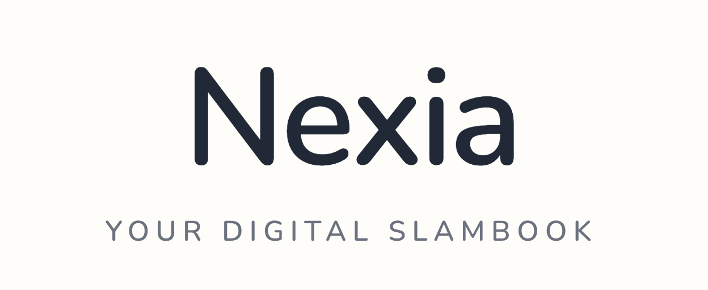

<!-- markdownlint-disable MD033 -->

<p align="center">
  
</p>

## Nexia

Nexia is a digital slambook for your people.

You add profiles for friends/family, store the details you usually forget later (favorite songs, random quotes, food quirks, old memories), and ask an AI chat assistant questions about them.

Think: "Who hates mushrooms?" or "What song reminds me of Sam?" and get answers from your own saved context.

## What It Does

- Create and manage rich friend profiles
- Search profiles by name and relationship
- Chat with AI using RAG over your profile data
- Auto-derive zodiac from birthday
- Background embedding sync via Redis workers

## Tech Stack

[](https://nextjs.org/)
[](https://react.dev/)
[](https://www.typescriptlang.org/)
[](https://tailwindcss.com/)
[](https://go.dev/)
[](https://gin-gonic.com/)
[](https://gorm.io/)
[](https://www.postgresql.org/)
[](https://github.com/pgvector/pgvector)
[](https://redis.io/)
[](https://github.com/hibiken/asynq)
[](https://ai.google.dev/)

## Quick Start (Docker)

```bash
export GEMINI_API_KEY=your_key_here
docker-compose up --build
```

Then open:

- App: [http://localhost:3000](http://localhost:3000)
- Swagger: [http://localhost:3000/api/v1/swagger/index.html](http://localhost:3000/api/v1/swagger/index.html)

## Manual Dev Setup

### 1. Start infra

```bash
docker-compose up -d postgres redis
```

### 2. Run backend

```bash
cd backend
go run cmd/server/main.go
```

### 3. Run frontend

```bash
cd frontend
npm install
npm run dev
```

### 4. Optional: backfill embeddings

```bash
cd backend
go run cmd/sync/main.go
```

## Project Docs

- Backend: [backend/README.md](./backend/README.md)
- Frontend: [frontend/README.md](./frontend/README.md)

## Contributor

- Md Hishaam Akhtar

<p align="center">
  Built for remembering people better.
</p>
