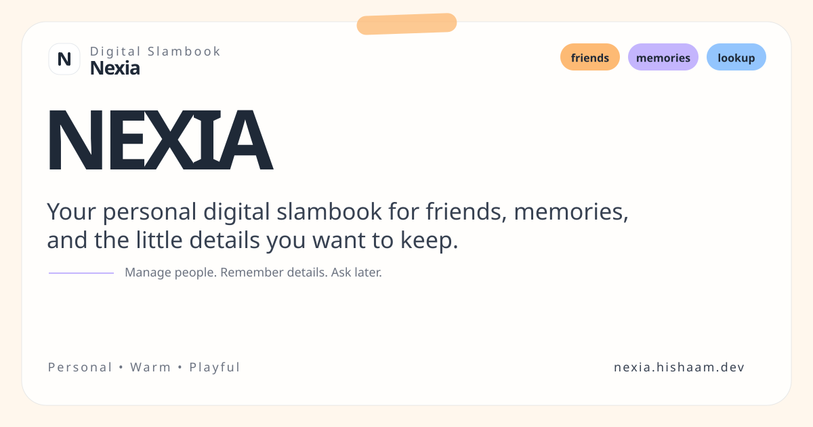

<!-- markdownlint-disable MD033 -->

<p align="center">
  
</p>

## Nexia

Nexia is a digital slambook for your people.

You add profiles for friends/family, store the details you usually forget later (favorite songs, random quotes, food quirks, old memories), and ask an AI chat assistant questions about them.

Think: "Who hates mushrooms?" or "What song reminds me of Sam?" and get answers from your own saved context.

## What It Does

- Create and manage rich friend profiles
- Search profiles by name and relationship
- Chat with AI using RAG over your profile data
- Auto-derive zodiac from birthday
- Background embedding sync via BullMQ workers

## Tech Stack

[](https://nextjs.org/)
[](https://react.dev/)
[](https://www.typescriptlang.org/)
[](https://tailwindcss.com/)
[](https://nodejs.org/)
[](https://hono.dev/)
[](https://orm.drizzle.team/)
[](https://www.postgresql.org/)
[](https://github.com/pgvector/pgvector)
[](https://redis.io/)
[](https://bullmq.io/)
[](https://sdk.vercel.ai/)

## Quick Start (Docker)

```bash
export GEMINI_API_KEY=your_key_here
export OPENCODE_API_KEY=your_key_here
# optional: export NEXIA_EMAIL_RESEND_API_KEY=your_key_here
docker compose up --build
```

Then open [http://localhost:3000](http://localhost:3000).

Use `./nexia.sh ra` to rebuild/restart all services, `./nexia.sh start` to start without rebuilding, `./nexia.sh wipe` to reset infra volumes.

## Manual Dev Setup

### 1. Start infra

```bash
docker compose up -d postgres redis
# or: ./nexia.sh infra
```

### 2. Install dependencies

```bash
npm install
```

### 3. Run backend (port 8080)

```bash
npm run dev:api
```

### 4. Run frontend (port 3000)

```bash
npm run dev:web
```

### 5. Optional: backfill embeddings

```bash
npm run sync -w api
```

## Scripts

| Command | Where | Purpose |
|---|---|---|
| `npm run typecheck` | root | Typecheck all workspaces |
| `npm run lint` / `lint:fix` | root | ESLint |
| `npm run format` / `format:check` | root | Prettier write / check |
| `npm test` | root | Run all tests |
| `npm run test:coverage` | root | Tests with the 90% coverage gate |
| `npm run test:unit` | root | Unit tests (no Docker) |
| `npm run test:integration` | root | Integration tests (needs Docker) |
| `npm run db:generate -w api` | root | Generate Drizzle migration |
| `./nexia.sh` | root | Docker helper (see `./nexia.sh` for commands) |

## Deployments

| Service | Platform | URL |
|---|---|---|
| Frontend | Vercel | [nexia.hishaam.dev](https://nexia.hishaam.dev) |
| Backend | Railway | [api.nexia.hishaam.dev](https://api.nexia.hishaam.dev) |

## Project Structure

This is an **npm workspaces monorepo**:

- `apps/api/` — Backend service (Node + Hono + Drizzle)
- `apps/web/` — Frontend application (Next.js 16)
- `packages/shared/` — Shared Zod schemas and types

## Documentation

See [CLAUDE.md](./CLAUDE.md) for detailed architecture, conventions, and development workflows.

## Contributor

- Md Hishaam Akhtar

<p align="center">
  Built for remembering people better.
</p>
