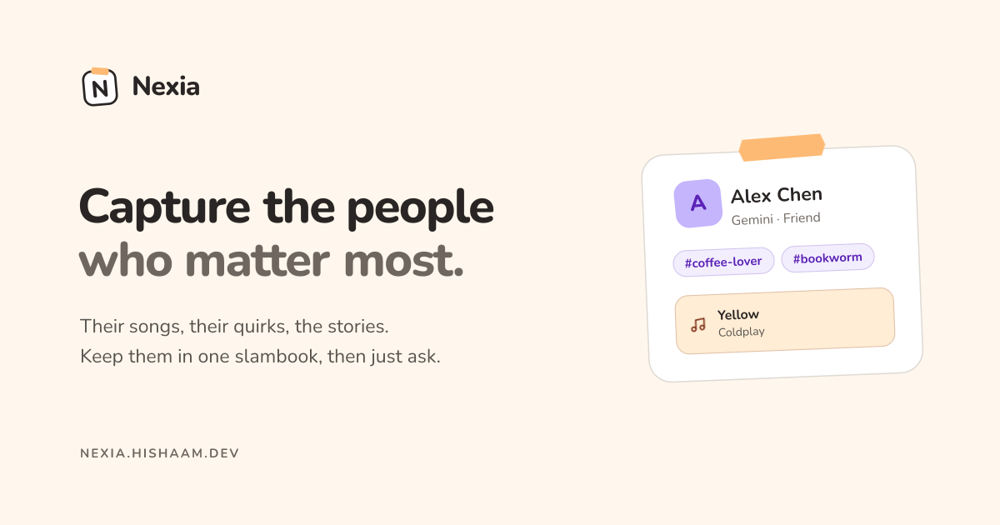
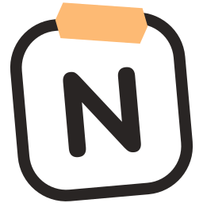

<!-- markdownlint-disable MD033 -->

<p align="center">
  
</p>

##  Nexia

Nexia is a digital slambook for your people.

You add profiles for friends/family, store the details you usually forget later (favorite songs, random quotes, food quirks, old memories), and ask an AI chat assistant questions about them.

Think: "Who hates mushrooms?" or "What song reminds me of Sam?" and get answers from your own saved context.

## What It Does

- Create and manage rich friend profiles
- Search profiles by name and relationship
- Ask Nexia: an AI chat that answers from your profiles (RAG over pgvector) and can add or update people, each change approved by you first
- Zodiac derived from the birthday
- Embeddings kept fresh in the background by an in-process worker, no queue to run

## Tech Stack

[](https://nextjs.org/)
[](https://react.dev/)
[](https://www.typescriptlang.org/)
[](https://tailwindcss.com/)
[](https://nodejs.org/)
[](https://hono.dev/)
[](https://orm.drizzle.team/)
[](https://www.postgresql.org/)
[](https://github.com/pgvector/pgvector)
[](https://ai-sdk.dev/)

## Quick Start (Docker)

```bash
export GEMINI_API_KEY=your_key_here
export OPENCODE_API_KEY=your_key_here
# optional: export NEXIA_EMAIL_RESEND_API_KEY=your_key_here
docker compose up --build
```

Then open [http://localhost:3000](http://localhost:3000).

Use `./nexia.sh ra` to rebuild/restart all services, `./nexia.sh start` to start without rebuilding, `./nexia.sh wipe` to reset the database volume.

Without `GEMINI_API_KEY` and `OPENCODE_API_KEY` everything but the chat works. Without a Resend key, emails are not sent and the verification and reset links are written to the API log instead.

## Manual Dev Setup

### 1. Start infra

```bash
docker compose up -d postgres
# or: ./nexia.sh infra
```

### 2. Install dependencies

```bash
npm install
```

### 3. Run backend (port 8080)

```bash
npm run dev:api
```

### 4. Run frontend (port 3000)

```bash
npm run dev:web
```

## Scripts

| Command | Where | Purpose |
|---|---|---|
| `npm run typecheck` | root | Typecheck all workspaces |
| `npm run lint` / `lint:fix` | root | ESLint |
| `npm run format` / `format:check` | root | Prettier write / check |
| `npm test` | root | Every Vitest test: shared, API unit + integration, web components |
| `npm run test:coverage` | root | The same, with one coverage report and the 90% gate |
| `npm run test:unit` | root | Unit and component tests only (no Docker) |
| `npm run test:integration` | root | API integration tests (needs Docker) |
| `npm run test:e2e` | root | Browser journeys with Playwright (needs Postgres running) |
| `npm run test:all` | root | Everything: `test:coverage`, then `test:e2e` |
| `npm run db:generate -w api` | root | Generate Drizzle migration |
| `npm run brand -w web` | root | Re-render the favicon, app icons and `docs/brand` from the mark |
| `./nexia.sh` | root | Docker helper (see `./nexia.sh` for commands) |

## Deployments

| Service | Platform | URL |
|---|---|---|
| Frontend | Vercel | [nexia.hishaam.dev](https://nexia.hishaam.dev) |
| Backend | Railway | [api.nexia.hishaam.dev](https://api.nexia.hishaam.dev) |

## Project Structure

This is an **npm workspaces monorepo**:

- `apps/api/` — Backend service (Node + Hono + Drizzle)
- `apps/web/` — Frontend application (Next.js 16)
- `packages/shared/` — Shared Zod schemas and types

## Documentation

- [CLAUDE.md](./CLAUDE.md): architecture, conventions and development workflows
- [DESIGN.md](./DESIGN.md): the design system (flat paper, pinned notes, type and colour)
- [PRODUCT.md](./PRODUCT.md): who it is for and how it should feel
- [docs/brand](./docs/brand): the mark, the wordmark and the social preview

## Contributor

- Md Hishaam Akhtar

<p align="center">
  Built for remembering people better.
</p>
